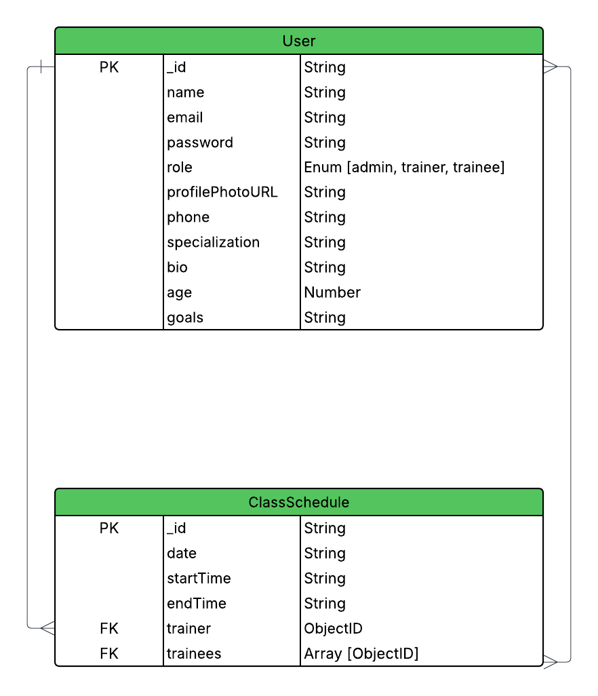

# 🏋️‍♂️ Gym Class Scheduling and Membership Management System

## 📄 Project Overview

This system efficiently manages gym operations by handling user registration, role-based permissions, class scheduling, and booking functionalities. It defines three roles — **Admin**, **Trainer**, and **Trainee** — with separate access and responsibilities.

## 🧱 Technology Stack

- **Programming Language:** TypeScript
- **Runtime:** Node.js
- **Framework:** Express.js
- **ODM:** Mongoose (MongoDB)
- **Authentication:** JWT (Access Token + Refresh Token)
- **Database:** MongoDB

## 🗂️ Project Structure (Modular Pattern)

```
src/
│
├── app/
│   ├── modules/
│   │   ├── auth
│   │   ├── user
│   │   ├── admin
│   │   ├── trainer
│   │   ├── trainee
│   │   └── classSchedule
│   ├── middlewares/
│   ├── routes/
│   ├── utils/
│   └── config/
│
├── server.ts
└── app.ts
```

## 🔐 Roles & Permissions

### 👑 Admin

- Create & manage trainers
- Schedule classes (max 5/day)
- Assign trainers to classes

### 🧑‍🏫 Trainer

- View assigned class schedules
- Cannot create/edit schedules or manage trainees

### 🧍‍♂️ Trainee

- Register, view, and manage own profile
- Book available class schedules (max 10 trainees/class)
- Cannot book multiple classes in the same time slot
- Can cancel their own bookings

## 🔄 Business Rules

- A day can have **max 5 class schedules**
- A class lasts **2 hours**
- **Max 10 trainees** per class
- **No duplicate time slots** for trainer or trainee

## 🔀 Public API

- View all scheduled classes (safe trainer info only, shows available slot count)

## 📘 Database Schema

### 🧑‍💼 User (Admin, Trainer, Trainee)

```ts
- name: string
- email: string
- password: string (hashed)
- role: 'admin' | 'trainer' | 'trainee'
- phone?: string
- profilePhotoURL?: string
- specialization?: string (trainer only)
- bio?: string (trainer only)
- age?: number (trainee only)
- goals?: string (trainee only)
```

### 🕒 ClassSchedule

```ts
- date: string (ISO)
- startTime: string (HH:mm)
- endTime: string (HH:mm, auto +2hr)
- trainer: ObjectId (User)
- trainees: ObjectId[] (User)
```

## 🔗 API Endpoints (Grouped)

### Auth (Public)

- `POST /auth/register`
- `POST /auth/login`
- `POST /auth/refresh-token`

### User (All Roles)

- `PATCH /user/update-profile`
- `GET /user/my-profile`

### Admin

- `POST /admin/create-trainer`
- `POST /admin/class-schedules`
- `GET /admin/class-schedules`
- `PATCH /admin/class-schedules/:classScheduleId/assign-trainer`

### Trainer

- `GET /trainer/my-schedules`

### Trainee

- `POST /trainee/book-class/:classId`
- `PATCH /trainee/cancel-booking/:classId`
- `GET /trainee/my-classes`

### Public

- `GET /class-schedules`

## 🧪 Admin Credentials (for Testing)

```
Email: admin1@example.com
Password: admin123
```

## 🌐 Live Hosting Link

**Backend Server**: [https://gym-management-backend-murex.vercel.app/](https://gym-management-backend-murex.vercel.app/)

## 📬 Postman Documentation

👉 [Click to view Postman collection](https://documenter.getpostman.com/view/17015286/2sB34foh3t)

## 🧪 Testing Instructions

1. **Login as Admin** using credentials above
2. **Create a Trainer** via `POST /admin/create-trainer`
3. **Schedule a Class** using `POST /admin/schedule-class`
4. **Assign Trainer** using `PATCH /admin/assign-trainer/:classId`
5. **Register a Trainee** using `/auth/register` (default role assigned)
6. **Book Class** via `/trainee/book-class/:classId`
7. **Cancel Booking** via `/trainee/cancel-booking/:classId`

## 🛠️ Run the Project Locally

```bash
git clone https://github.com/Th3At0nic/Gym-Management-Backend.git
cd Gym-Management-Backend
bun install

# Create .env file with required environment variables
cp .env.example .env

# Edit the .env file and fill in your own secrets before running the server

# Start server
dev: bun run start:dev
```

## 🗺️ Entity Relationship Diagram



👉 [Click here to view full diagram in Lucidchart](https://lucid.app/lucidchart/6aa0cbf7-fc1f-498a-99bb-b447c3da79eb/view)

---

### ✨ Future-Proofing & Extra Enhancements

To go beyond the base requirements and simulate a real-world, scalable system, several extra features and architectural decisions were implemented:

- Extensible user model with additional fields like `bio`, `specialization`, `age`, `goals`, and profile picture.
- Role-specific profile update logic with secure Cloudinary image upload.
- Strong modular structure separating concerns by role and functionality.
- Advanced role-based access control middleware.
- Booking and trainer assignment logic with overlap/time-conflict prevention.
- Global error handler aligned with standard API response formats.
- Public class schedule endpoint for booking discovery.
- Complete Postman documentation with token/env support.
- `.env.example` provided for quick setup and environment consistency.

These improvements were implemented to make the system future-ready, developer-friendly, and production-aligned.

✅ All features are implemented based on the provided task description.
🚀 Project is complete, tested, and submitted on time!

> "Focus was on clean architecture, role separation, business rule enforcement, and security."
